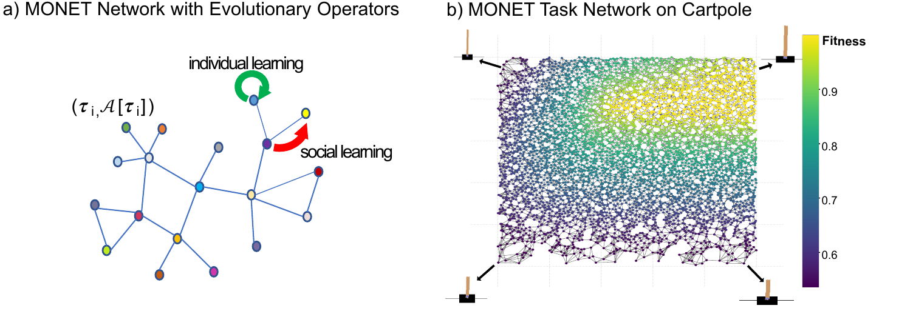
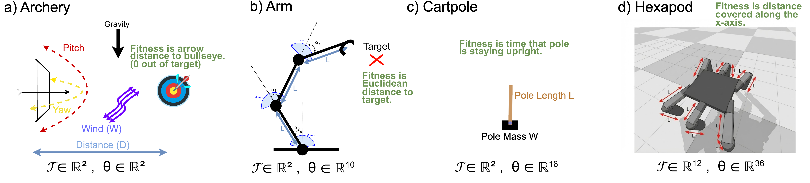

<h1 align="center">
  MONET:<br/>Multi-Task Optimization over Networks of Tasks
</h1>

<p align="center">
  <a href="LICENSE"></a>
  <a href="https://arxiv.org/abs/2604.21991"></a>
  <a href="supplementary/"></a>
  <a href="https://www.python.org/"></a>
  <a href="https://hydra.cc"></a>
  <a href="https://pypi.org/project/spotoptim/"></a>
</p>

<p align="center">
  <em>A graph-based multi-task optimization algorithm that treats
  tasks as nodes of a similarity graph and transfers knowledge between
  related tasks through <b>individual learning</b> (mutation) and <b>social
  learning</b> (crossover with graph neighbors).</em>
</p>

<p align="center">
  
</p>

<p align="center">
  <b>Authors:</b>
  <a href="https://julianhatzky.me/">Julian Hatzky</a> &middot;
  <a href="https://www.th-koeln.de/en/person/thomas.bartz-beielstein/">Thomas Bartz-Beielstein</a> &middot;
  <a href="https://www.cs.vu.nl/~gusz/">A.&nbsp;E.&nbsp;Eiben</a> &middot;
  <a href="https://www.anilyaman.com/">Anil Yaman</a>
</p>

---

## ✨ Overview

Existing multi-task optimizers face a **scalability–structure tradeoff**:
population-based methods do not scale to thousands of tasks, and the
MAP-Elites variants that do scale ignore the topology of the task space.

**MONET** closes this gap by representing the optimization state as a
labelled graph

<p align="center">
  <code>G = (V, E, A)</code>,&nbsp;&nbsp;
  <code>V</code> = tasks, &nbsp;
  <code>E</code> = <em>k</em>-NN edges in task space, &nbsp;
  <code>A</code> = per-node elite.
</p>

Each evaluation step either mutates the focal node's elite (*individual
learning*) or recombines it with an elite drawn from its graph
neighborhood (*social learning*, SBX crossover). The reference
implementation in this repo scales to **5,000 tasks** on arm / archery
/ cartpole and **2,000 tasks** on the PyBullet hexapod benchmark.

<p align="center">
  
</p>

## ⚙️ Setup

```bash
# 1. Clone the PPSN release branch
git clone --branch PPSN-MONET-introduction https://github.com/ju2ez/MONET.git && cd MONET

# 2. Install everything (creates .venv, compiles vendored PyBullet)
uv sync
```

Python **3.14.2+** is required. All dependencies are pinned in
`pyproject.toml` and locked by `uv`.

> [!NOTE]
> **PyBullet is built from source.** The vendored Bullet Physics SDK
> under `vendor/pybullet/` is compiled locally by `uv sync`. This
> sidesteps the flaky prebuilt-wheel install that occasionally fails on
> macOS with recent Python versions. On macOS make sure the Xcode
> Command Line Tools are available (`xcode-select --install`); any
> system C++ compiler works. The `vendor/pybullet/build/` directory is
> gitignored and can be deleted to force a clean rebuild.

## 🚀 Quick start

```bash
# Default run (hexapod + MONET, 1M evals, seed auto)
uv run python run_algorithms.py

# Switch task / algorithm
uv run python run_algorithms.py task=arm      algorithm.name=MONET
uv run python run_algorithms.py task=archery  algorithm.name=PT-ME
uv run python run_algorithms.py task=cartpole algorithm.name=MT-ME
```

Outputs land under `outputs/` (single run) or `multirun/` (sweep).
Metrics stream to Weights&nbsp;&&nbsp;Biases when `wandb.enabled=true`,
and to CSV via `utils/file_logger.py` otherwise.

### Parameter sweep (Hydra multirun)

```bash
uv run python run_algorithms.py -m \
  task=hexapod algorithm.name=MONET \
  seed=0,1,2,3,4 \
  algorithm.MONET.strategy=best_fitness,random,fitness_proportional \
  algorithm.MONET.neighborhood=closest,random,distance_proportional \
  algorithm.MONET.neighbor_percentage=0.005,0.01,0.05
```

### Hyperparameter tuning with SpotOptim

`hpt_spot.py` wraps `run_algorithms.py` as a black-box evaluator for
[SpotOptim](https://pypi.org/project/spotoptim/)
(Bartz-Beielstein *et&nbsp;al.*,
[arXiv:2604.13672](https://arxiv.org/abs/2604.13672)).

```bash
uv run python hpt_spot.py                                  # sequential
uv run python hpt_spot.py --n_jobs 4                       # 4 concurrent trials
uv run python hpt_spot.py --n_jobs 4 --result-dir runs/spot_hexapod
```

Re-running with an existing `spot_monet_res.pkl` in the result
directory resumes from the stored surrogate state. Search space,
budget (`max_iter`, `max_time`), and the fixed task / algorithm live
at the top of `hpt_spot.py`.

## 🔑 MONET hyperparameters (`config/config.yaml`)

| Parameter              | Values                                                    | Role                                                 |
|------------------------|-----------------------------------------------------------|------------------------------------------------------|
| `p_ind`                | `[0, 1]`                                                  | probability of individual learning vs. social learning |
| `strategy`             | `best_fitness`, `random`, `fitness_proportional`, `plane_dd` | parent-selection rule within the neighborhood       |
| `neighborhood`         | `closest`, `random`, `distance_proportional`              | how the task-graph neighborhood of each node is built |
| `neighbor_percentage`  | `[0, 1]`                                                  | fraction of tasks used as graph neighbors            |
| `individual_learning`  | `gaussian_mutation`, `polynomial_mutation`                | mutation operator                                    |
| `social_learning`      | `sbx`, `iso_dd`, `iso_mtme`, `regression`                 | crossover / recombination operator                   |

See `supplementary/algorithm_and_hyperparameters.pdf` for the full
sensitivity analysis and SPOT-tuned per-domain configurations.

## 📂 File structure

```text
algorithms/                   core algorithms
  monet.py                    MONET (ours): graph-over-tasks QD
  mt_me.py                    MT-ME baseline (Mouret & Maguire, 2020)
  pt_me.py                    PT-ME baseline (Anne & Mouret, 2024)
  common.py                   genetic operators (iso+line-dd, SBX, mutations)
  mt_me_common.py             MT-ME helpers (CVT archive, niche selection)
  runners/                    dispatcher: config → algorithm → logger
environments/                 task / fitness implementations
  hexapod_env.py              36D gait, 12D morphology task, 2,000 tasks
  robotic_arm_env.py          10-DoF arm kinematics, 5,000 tasks
  archery_env.py              projectile physics, 5,000 tasks
  cartpole_env.py             NN-controlled cartpole, 5,000 tasks
  pyhexapod/                  INRIA hexapod simulator (vendored)
config/                       Hydra configuration (config.yaml + SLURM launcher)
utils/                        logger, visualization, helpers
docs/                         supplementary reference notes
vendor/pybullet/              vendored Bullet Physics SDK (built on `uv sync`)
supplementary/                appendix PDFs extracted from the paper
  tasks_and_environments.pdf  per-domain fitness definitions
  algorithm_and_hyperparameters.pdf  MONET pseudocode + sensitivity analysis
assets/                       README banners
run_algorithms.py             Hydra entry point
hpt_spot.py                   SpotOptim-driven hyperparameter tuning wrapper
```

## 📄 Paper & supplementary material

- **Tasks & closed-form fitness** → [`supplementary/tasks_and_environments.pdf`](supplementary/tasks_and_environments.pdf)
- **Algorithm, hyperparameters, SHAP & SPOT analysis, coupon-collector bounds** → [`supplementary/algorithm_and_hyperparameters.pdf`](supplementary/algorithm_and_hyperparameters.pdf)

## 🙏 Acknowledgements

This codebase builds on several pieces of prior work released under
the **CeCILL** free-software license. We are grateful to their authors.

- **[pymap_elites](https://github.com/resibots/pymap_elites)** —
  Mouret & Clune,
  [*Illuminating search spaces by mapping elites*](https://arxiv.org/abs/1504.04909)
  (arXiv:1504.04909, 2015). Genetic operators in `algorithms/common.py`
  and the base framework are adapted from pymap_elites
  (Copyright 2019, INRIA; Jean-Baptiste Mouret, Eloise Dalin,
  Pierre Desreumaux). Original file headers are preserved.
- **MT-ME** — Mouret & Maguire,
  [*Quality Diversity for Multi-Task Optimization*](https://arxiv.org/abs/2003.04407)
  (GECCO 2020). Implemented in `algorithms/mt_me.py`.
- **PT-ME** — Anne & Mouret,
  [*Parametric-Task MAP-Elites*](https://arxiv.org/abs/2402.01275)
  (GECCO 2024). Implemented in `algorithms/pt_me.py`.
- **[pyhexapod](https://github.com/resibots/pyhexapod)** — the PyBullet
  hexapod simulator under `environments/pyhexapod/` is the INRIA
  `pyhexapod` package, redistributed verbatim together with its own
  `COPYING` / `COPYING.fr` license files.
- **[SpotOptim](https://pypi.org/project/spotoptim/)** — Bartz-Beielstein,
  *Optimization with SpotOptim*,
  [arXiv:2604.13672](https://arxiv.org/abs/2604.13672). The
  hyperparameter-tuning loop in `hpt_spot.py` is built on top of this
  package.
- **[Bullet Physics SDK / PyBullet](https://github.com/bulletphysics/bullet3)** —
  Erwin Coumans *et&nbsp;al.* The source tree under `vendor/pybullet/`
  is a verbatim snapshot of `bullet3`, vendored so that `uv sync` can
  build the Python bindings locally on platforms where the prebuilt
  wheels fail. Distributed under the terms of its own `LICENSE.txt`
  (zlib-style, permissive).

## 📚 Citing

If you find this project useful, please cite:

```bibtex
@misc{hatzky2026multitaskoptimizationnetworkstasks,
  title         = {Multi-Task Optimization over Networks of Tasks},
  author        = {Julian Hatzky and Thomas Bartz-Beielstein and A. E. Eiben and Anil Yaman},
  year          = {2026},
  eprint        = {2604.21991},
  archivePrefix = {arXiv},
  primaryClass  = {cs.LG},
  url           = {https://arxiv.org/abs/2604.21991},
}
```

…and, where relevant:

```bibtex
@inproceedings{anne2024ptme,
  title     = {Parametric-Task MAP-Elites},
  author    = {Anne, Timoth{\'e}e and Mouret, Jean-Baptiste},
  booktitle = {Proc.\ GECCO 2024},
  pages     = {68--77},
  year      = {2024},
  doi       = {10.1145/3638529.3654159}
}

@inproceedings{mouret2020qdmt,
  title     = {Quality Diversity for Multi-Task Optimization},
  author    = {Mouret, Jean-Baptiste and Maguire, Glenn},
  booktitle = {Proc.\ GECCO 2020},
  pages     = {121--129},
  year      = {2020},
  doi       = {10.1145/3377929.3390079}
}

@misc{bartzbeielstein2026spotoptim,
  title  = {Optimization with {SpotOptim}},
  author = {Bartz-Beielstein, Thomas},
  year   = {2026},
  eprint = {2604.13672},
  archivePrefix = {arXiv}
}
```

## 📜 License

Released under the **CeCILL Free Software License Agreement v2.1**
(French counterpart to GPL; see [`LICENSE`](LICENSE)). This matches the
license of the upstream `pymap_elites` and `pyhexapod` components on
which MONET builds. The vendored Bullet Physics SDK under
`vendor/pybullet/` retains its own zlib-style license (see
`vendor/pybullet/LICENSE.txt`).
